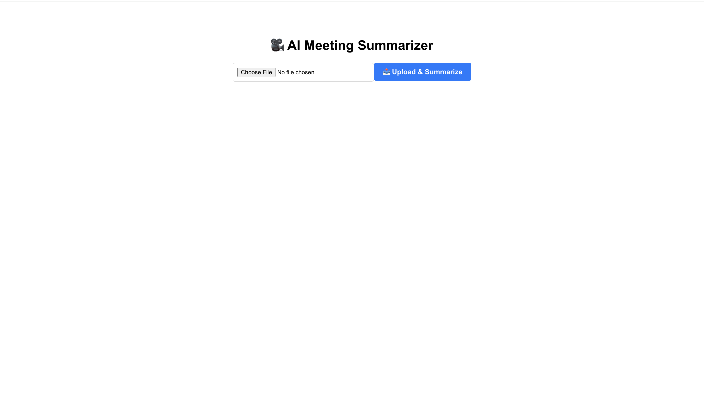
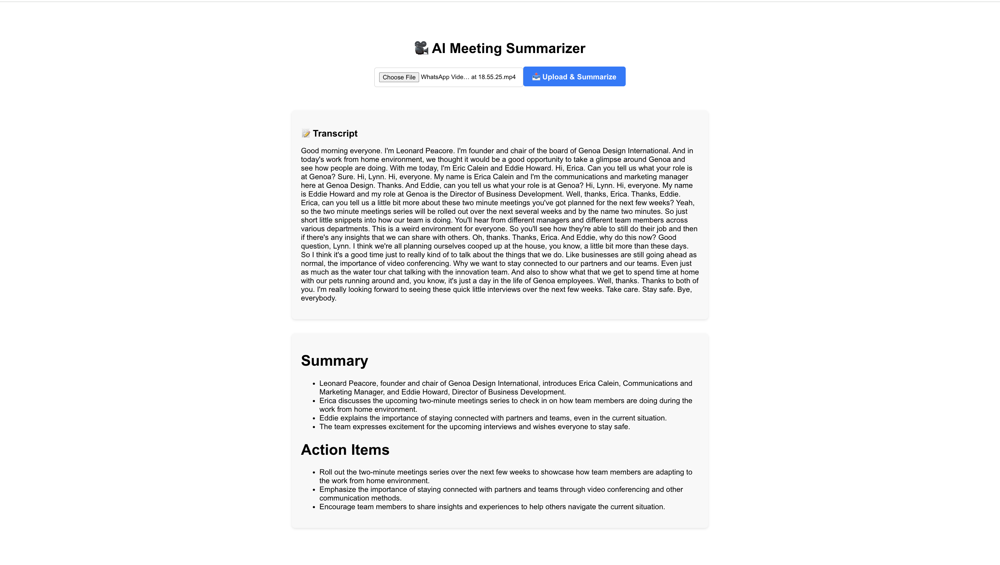

# Video Summarizer with Whisper + GPT

A full-stack AI-powered web application that allows users to upload meeting videos, extract transcripts using OpenAI Whisper, and generate concise summaries using GPT-3.5. Built with a Flask backend and a React frontend.

---

## 🌟 Features

- 🎬 Upload MP4 video files
- 🎙️ Extract audio and transcribe with OpenAI Whisper
- 🧠 Summarize using GPT-3.5
- 📋 Display transcript and summary in Markdown
- 🌐 Frontend hosted on Netlify, backend hosted on EC2 with Gunicorn + Nginx

---

## 🛠 Tech Stack

### 🧩 Backend (Python + Flask)
- Flask + Flask-CORS
- OpenAI Whisper
- OpenAI GPT-3.5 (Chat Completions API)
- MoviePy (for audio extraction)
- Gunicorn (WSGI server)
- Nginx (Reverse Proxy)
- Deployed on: AWS EC2 (Ubuntu)

### 🎨 Frontend (React + Netlify)
- React (Create React App)
- Axios (API calls)
- React Markdown (to render summaries nicely)
- Hosted on: [Netlify](https://www.netlify.com/)

---

## 📁 Project Structure

```
project-root/
├── api/                # Flask backend
│   ├── app.py
│   ├── uploads/
│   ├── results/
│   └── requirements.txt
├── client/             # React frontend
│   ├── public/
│   ├── src/
│   └── package.json
└── README.md
```

---

## 🚀 Deployment

### ✅ Backend Setup (EC2 + Gunicorn + Nginx)

1. SSH into EC2
2. Upload backend folder to `/home/ubuntu/api`
3. Install dependencies:

```bash
sudo apt update
sudo apt install python3-pip python3-venv nginx -y
cd ~/api
python3 -m venv venv
source venv/bin/activate
pip install -r requirements.txt
```

4. Test locally with Gunicorn:
```bash
gunicorn --bind 0.0.0.0:5000 app:app
```

5. Set up `systemd` service (see instructions above)

6. Set up Nginx reverse proxy:
```nginx
proxy_pass http://unix:/home/ubuntu/api/api.sock;
```

7. Allow port 80 in EC2 Security Group

---

### ✅ Frontend Setup (Netlify)

1. Build the app:
```bash
cd client
npm install
npm run build
```

2. Drag `build/` folder to [Netlify Drop](https://app.netlify.com/drop)
3. Set `REACT_APP_BACKEND_URL` to your EC2 public IP (via `.env`)

---

## 📦 API Endpoints

| Method | Endpoint           | Description                    |
|--------|--------------------|--------------------------------|
| GET    | `/api/health`      | Health check                   |
| POST   | `/api/upload`      | Upload video & return summary  |

---

## 📸 Screenshots




---

## 🔐 Environment Variables

| Key               | Description                     |
|------------------|---------------------------------|
| `OPENAI_API_KEY` | Your OpenAI GPT API key         |
| `AWS credentials`| (Optional if using S3 upload)   |

---

## 👨‍💻 Authors

- **Nithin** — Backend & Frontend Integration

---

## 📄 License

MIT License. Feel free to use, modify, and share!

---

## 🙌 Contributions

PRs are welcome! Please open an issue first to discuss what you’d like to change.
